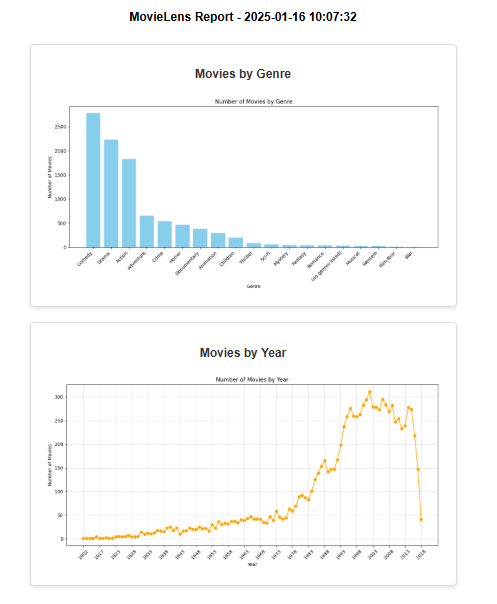
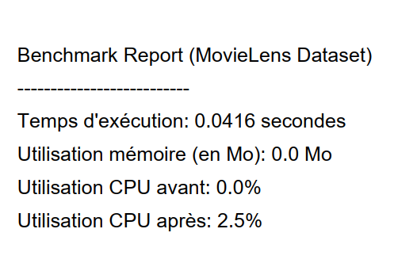

# data_movie_pipeline_CI-CD

Ce projet met en œuvre des workflows **DataOps** automatisés avec **GitHub Actions**. Il inclut des scripts pour récupérer des données, générer des visualisations, effectuer des benchmarks, et gérer des fichiers volumineux avec nettoyage et compression.

---

## Fonctionnalités principales

1. **Récupération des données** : Extraction via CSV.
2. **Visualisations et rapports** : Création de graphiques avec **matplotlib** ou **seaborn** et génération de rapports en PDF ou HTML.
3. **Benchmarks** : Analyse des performances des transformations de données (temps d'exécution, mémoire, CPU).
4. **Compression et nettoyage** : Optimisation des fichiers volumineux en les convertissant au format **Parquet**.
5. **Automatisation** : Intégration dans des workflows GitHub Actions.

---

## Architecture du projet

```plaintext
data_movie_pipeline_CI-CD/
│
├── .github/workflows/       # Workflows GitHub Actions pour automatiser les tâches
│   ├── benchmark.yml        # Exécution automatique des benchmarks 
│   ├── data_cleaning.yml    # Nettoyage et compression automatisés 
│   ├── data_loading.yml     # Récupération automatique des données 
│   └── data_vizualising.yml # Génération automatisée des visualisations 
├── data/                    # Données d'entrée 
│   ├── movie.csv               
├── scripts/                # Scripts Python
│   ├── benchmark_script.py     # Benchmark de transformation
│   ├── data_cleaning_script.py # Nettoyage et compression
│   ├── data_loading_script.py  # Récupération des données 
│   └── data_vizualising.py     # Visualisations et rapports
├── .gitignore              # Fichiers et dossiers à exclure du suivi Git
├── README.md               # Documentation du projet
```
---

## Cloner le dépôt en local
Clonez le dépôt dans votre environnement local à l'aide de la commande suivante :

```bash
git clone https://github.com/NRMiary/data_movie_pipeline_CI-CD.git

---

## Workflows GitHub Actions

Les workflows sont configurés dans le répertoire `.github/workflows` et permettent d'automatiser plusieurs étapes du pipeline DataOps. Ces workflows s'exécutent selon des déclencheurs spécifiques (manuels, programmés ou dépendants d'autres workflows). Voici un résumé des principales automatisations :

- **Récupération des données** :  
  Ce workflow peut être déclenché manuellement ou automatiquement à la suite d'un autre workflow (par exemple, "Movielens Data Analysis"). Il est également programmé pour s'exécuter chaque vendredi à minuit UTC (`cron: '0 0 * * 5'`).

- **Génération de rapports** :  
  Automatise la création de visualisations et de rapports à l'aide du script `data_viz.py`. Ce workflow se déclenche :
  - Automatiquement après la fin du workflow "Data loading".
  - Manuellement si nécessaire via l'interface GitHub Actions.

- **Benchmarks** :  
  Ce workflow mesure la performance des transformations (temps d'exécution, utilisation des ressources). Il est configuré pour :
  - Être déclenché après le workflow "Data Cleaning and Compression".
  - S'exécuter automatiquement le premier jour de chaque mois à minuit UTC (`cron: '0 0 1 * *'`).
  - Être exécuté manuellement si besoin.

---

### Déclencheurs principaux utilisés :

1. **`schedule`** : Permet d'exécuter automatiquement un workflow à des intervalles réguliers grâce à des expressions CRON.
2. **`workflow_dispatch`** : Autorise l'exécution manuelle des workflows via l'interface GitHub Actions.
3. **`workflow_run`** : Lance un workflow automatiquement lorsqu'un autre workflow (précédent dans la chaîne) est terminé.
4. **`push`** : Déclenche un workflow après un push vers la branche `main`.

---

## Résultats et captures d'écran

### Exemple de graphique généré

Voici un exemple de graphique généré par le script `data_vizualising_script.py` :



---

### Rapport PDF généré

Une capture d'écran du rapport PDF généré (par `benchmark_script.py`) :



